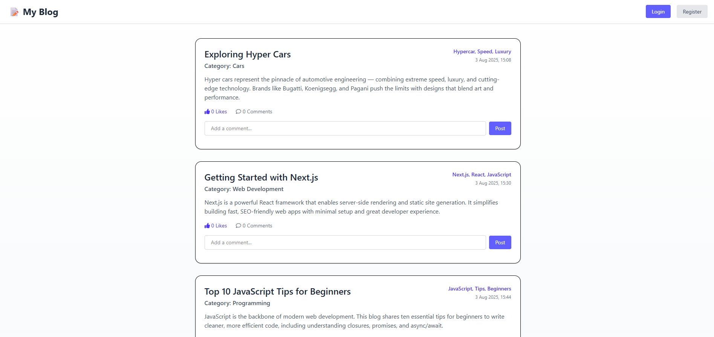
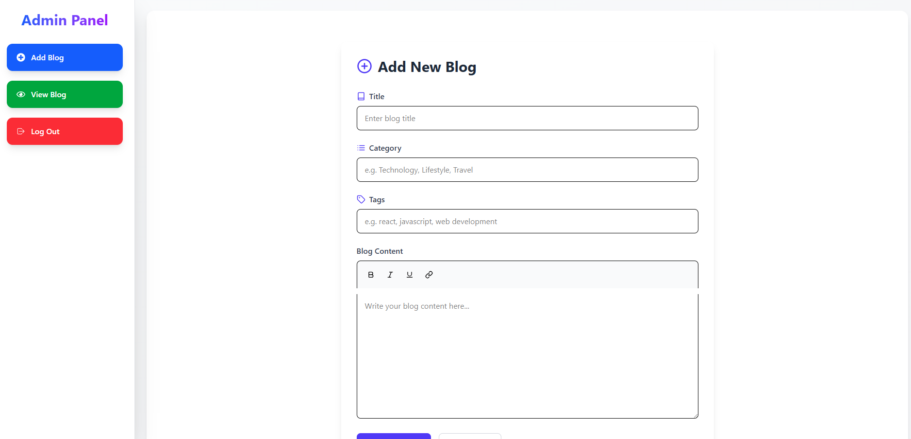
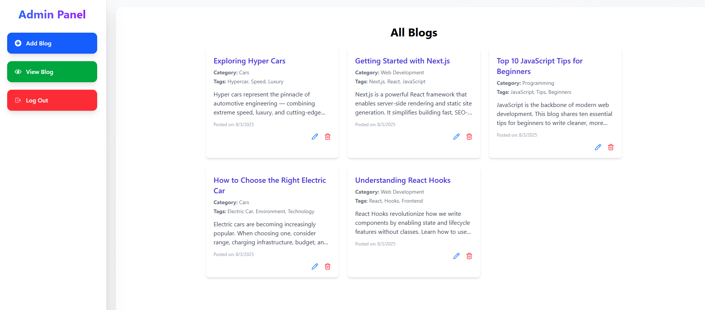
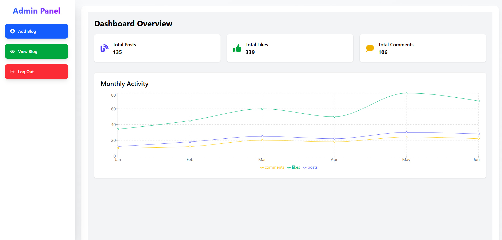
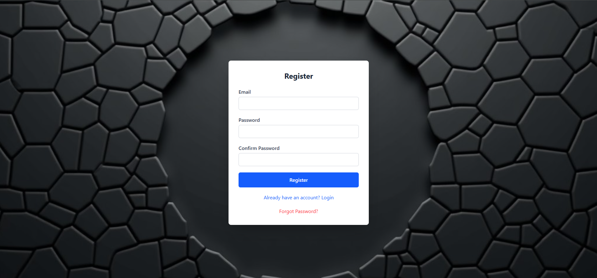

# 🚀 React Blog Website

This is a full-featured blog website built using **React + Vite** with state management via **Redux Toolkit (RTK Query)** and a mock backend powered by **MockAPI.io**.

---

## 🌟 Features

- 📝 Add, View, Edit, and Delete blogs
- 🔄 Auto-refresh using `tagTypes` in RTK Query
- 🔐 Authentication (Login, Register, Logout)
- ✅ Form validation with **Formik + Yup**
- 🌐 Uses [MockAPI.io](https://mockapi.io) as backend
- 🖋️ Rich-text blog content (React Quill)
- 💡 Clean responsive UI with modern design

---

tagTypes: ["Blog"],

invalidatesTags: ["Blog"], // used in mutation to refetch blogs

## 📸 Screenshots

> Add these inside a folder called `screenshots/` at the root of your project.

### 🏠 Dashboard


### 📝 Add Blog


### 🔍 View Blogs


### 🔍 Admin Dash


### ✏️ Edit Blog


### 🔐 Login

### 🔐 Register



## 🔧 Tech Stack

| Layer          | Technology                |
| -------------- | ------------------------- |
| Frontend       | React + Vite              |
| API Layer      | Redux Toolkit + RTK Query |
| Forms          | Formik + Yup              |
| Backend (Mock) | [MockAPI.io](https://mockapi.io) |
| Editor         | React Quill               |
| UI Alerts      | SweetAlert2               |

---

## ⚙️ CRUD Operations

We use **RTK Query** for interacting with `MockAPI.io`:

- `useAddBlogMutation` – Add new blog
- `useGetAllBlogsQuery` – Fetch all blogs
- `useUpdateBlogMutation` – Update blog
- `useDeleteBlogMutation` – Delete blog

### 🔄 Auto Refresh with `tagTypes`

```js

